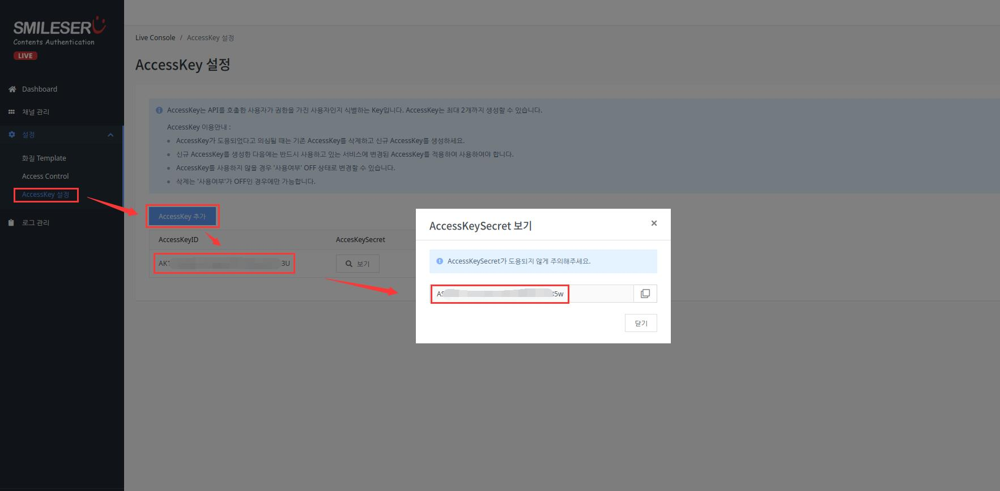

# Live

SDK for iwinv live API.
SDK를 사용하면 편리하고 안전하게 API 연결을 할수있다.

## Setting

`setting.inc` 파일은 기본설정파일이다.

*  Live(단독형) 서비스의 도메인 `setting.inc` 의 `apiDomain`로 설정한다.
* API 버전을 `setting.inc`의`version`로 설정한다.

* 아래 그림과 같이 **콘솔**에서 `설정` -> `AccessKey 설정` 에서 accesskey를 생성하며
**accesskey ID** 과 **secret**를 `setting.inc`의`accesskeyId`,`accesskeySecret` 로 설정한다.

  

## Channel.php

**Class**에서 아래와 같이 **Method**를 포함하여 호출해서 사용할수 있다.

* `channelList ()` -> 체널 목록 검색.
* `channelDetail ( $id )` -> 체널 상세 검색.

## 버전관리

최신버전은 `v1` 이다.
`setting.inc`의 `version`로 설정한다.

